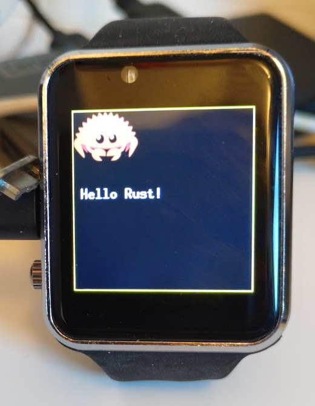

# Twatch ISR

Minimal project demonstrating rust-esp32-idf on the TTGO T-Watch 2020 v1 with an
Interrupt Service Routine handling the AXP202 PMU.

This was an early example. You should probably check https://github.com/pyaillet/twatch-idf-rs which is more advanced.

